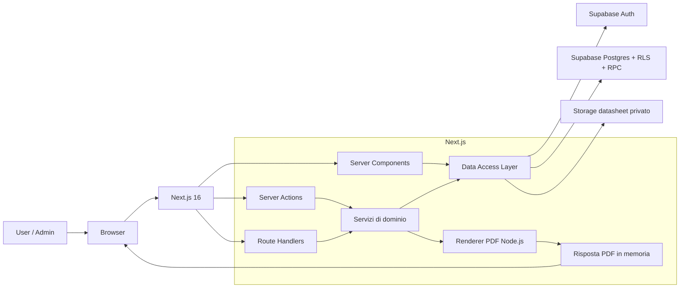
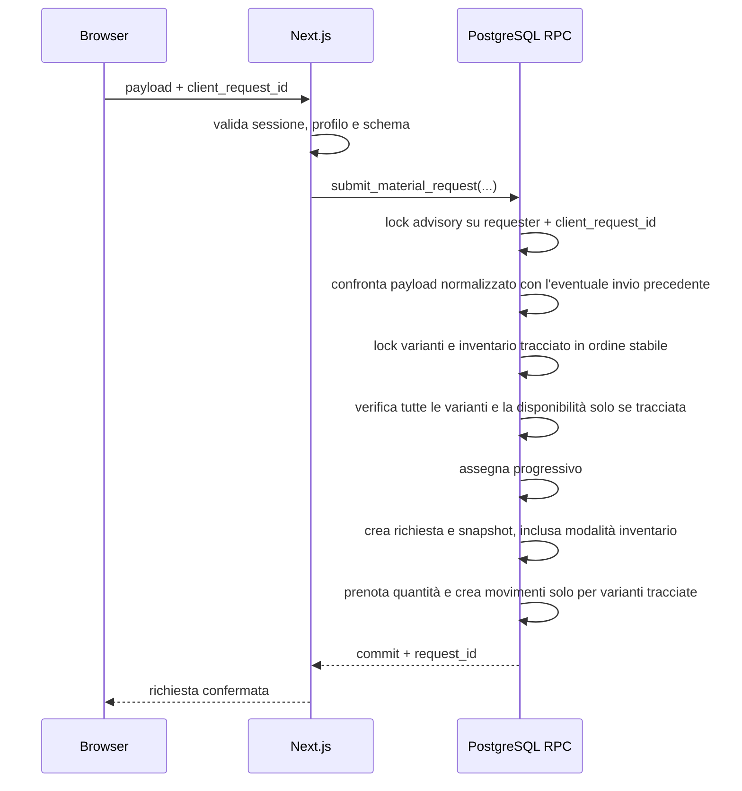

# Fabtek Materiali — Architettura tecnica

> Stato: proposta implementativa originaria, aggiornata per il flusso PDF on-demand al 31/08/2026.
> Fonti: `products.md`, `rls.md`, `mock.html`, `mock pdf richiesta user.pdf` e codice corrente.  
> Questo documento descrive come costruire il prodotto; `products.md` resta la fonte primaria per requisiti e regole di business.

## 1. Obiettivo architetturale

Fabtek Materiali sarà un monolite modulare web basato su Next.js e Supabase. L'interfaccia, il backend applicativo e la generazione PDF vivono nella stessa applicazione Next.js; autenticazione, database relazionale, transazioni, RLS e storage dei datasheet sono gestiti da Supabase.

Principi:

- il browser non è mai una fonte autorevole per identità, ruolo, date, progressivi, disponibilità o stati;
- Next.js orchestra i casi d'uso e integra PDF e gestione utenti;
- PostgreSQL protegge invarianti, concorrenza e autorizzazioni sui dati;
- le operazioni critiche sono atomiche e idempotenti;
- i PDF ufficiali sono generati in memoria al click e non vengono persistiti;
- la RLS resta attiva anche quando l'accesso passa dal server Next.js;
- la struttura iniziale rimane un monolite, senza microservizi non necessari.

## 2. Stato reale della repository

### 2.1 Baseline presente

| Area | Stato attuale |
|---|---|
| Framework | Next.js `16.3.2`, App Router, React `19.2.8`, TypeScript strict |
| Rendering | `cacheComponents: true`; Server Components già disponibili |
| UI | Tailwind CSS `4.3.3`, shadcn/ui, Radix, Lucide, tema chiaro/scuro |
| Auth | Starter Supabase SSR con client browser/server e refresh sessione in `proxy.ts` |
| Flussi Auth | Login, signup, conferma OTP, recupero e cambio password |
| Database locale | Supabase PostgreSQL 17 con migration zero, seed, RLS, RPC e bucket privati validati tramite `db reset`; il bucket PDF è ora legacy |
| Qualità | ESLint configurato; `npm run lint` passa sullo stato corrente |

### 2.2 Parti ancora mancanti

- Le pagine principali sono ancora quelle dimostrative dello starter Next.js/Supabase.
- Lo schema dati esiste, ma non sono ancora implementati import CSV, DAL, schermate catalogo/inventario/richieste, dashboard o gestione utenti di dominio.
- `rls.md` è stato recepito nella migration zero con i soli ruoli applicativi `user` e `admin`, profili attivi e privilegi espliciti.
- Il renderer PDF e gli endpoint ufficiali on-demand sono implementati; il bucket documentale legacy viene rimosso separatamente tramite Storage API.
- Non esistono un Data Access Layer, servizi di dominio, validazione condivisa o client Supabase privilegiato server-only.
- Non è presente una suite di test.
- `.env.example` contiene solo le due variabili Supabase pubbliche.

### 2.3 Debiti tecnici da risolvere prima delle feature

1. `next`, `@supabase/ssr` e `@supabase/supabase-js` sono dichiarati come `latest`: vanno fissate versioni riproducibili.
2. `eslint-config-next` è `15.3.1` mentre Next.js è `16.3.2`: le major devono essere allineate.
3. La configurazione Supabase locale consente signup pubblico, non richiede conferma email e accetta password da 6 caratteri; il prodotto prevede invece utenti gestiti dall'Admin.
4. `/auth/sign-up` è pubblica e va rimossa o resa inaccessibile nell'applicazione finale.
5. Il callback Auth accetta il parametro `next` senza una allow-list esplicita; deve consentire solo path locali ammessi.
6. Metadata, lingua HTML, testi e pagine protette sono ancora quelli dello starter.
7. Con Tailwind 4 convivono configurazione CSS-first e un `tailwind.config.ts` ereditato: va mantenuta una sola sorgente coerente dei token.

## 3. Vista di sistema



## 4. Responsabilità dei componenti

### Browser

- renderizza UI e stato temporaneo del carrello;
- esegue validazioni utili all'esperienza utente;
- può produrre la distinta in bozza tramite una vista di stampa dedicata;
- invia intenti e chiavi di idempotenza al server;
- non accede mai a service role o tabelle interne.

### Next.js

- usa Server Components per letture iniziali;
- usa Server Actions per mutazioni originate dai form dell'app;
- usa Route Handler per callback Auth, download controllati e integrazioni HTTP;
- valida payload, sessione, profilo attivo e autorizzazione per ogni operazione;
- chiama funzioni RPC PostgreSQL per le transazioni critiche;
- genera al click i PDF ufficiali nel runtime Node.js e restituisce direttamente il `Buffer`;
- usa la Supabase Admin API solo per la gestione utenti.

I Route Handler e le Server Actions devono essere trattati come endpoint pubblici. `proxy.ts` serve al refresh della sessione e ai redirect ottimistici, non sostituisce i controlli nei casi d'uso.

### Supabase Postgres

- conserva dati applicativi e snapshot storici;
- applica RLS e privilegi SQL;
- assegna progressivi e timestamp autorevoli;
- esegue prenotazioni ed evasioni atomiche;
- mantiene movimenti e audit;
- impedisce quantità negative, duplicati e riferimenti non validi.

### Supabase Storage

- bucket privato `datasheets` per documenti tecnici;
- accesso tramite policy o signed URL di breve durata;
- nessun URL pubblico permanente nei dati di dominio.

### PDF ufficiali on-demand

- il dettaglio richiesta invoca `GET /api/requests/[requestId]/pdf/[kind]`;
- il Route Handler verifica sessione, profilo, permesso e visibilità RLS;
- la richiesta ufficiale usa gli snapshot delle righe; il report finale aggiunge tutte le evasioni e richiede stato `evasa`;
- il renderer produce il documento in memoria e la stessa risposta HTTP lo restituisce come attachment non cacheabile;
- nessun PDF ufficiale viene caricato in Storage, scritto su filesystem o inviato automaticamente via email.

## 5. Struttura target della repository

La struttura può evolvere senza introdurre una cartella `src` obbligatoria:

```text
app/
  (auth)/
    auth/login/
    auth/forgot-password/
    auth/update-password/
  (app)/
    layout.tsx
    page.tsx
    catalogo/
    richieste/
      nuova/
      [requestId]/
    admin/
      page.tsx
      catalogo/
      inventario/
      richieste/
      utenti/
  api/
    auth/confirm/route.ts
    documents/draft/route.ts
    requests/[requestId]/pdf/[kind]/route.ts
components/
  ui/
  layout/
  catalog/
  requests/
  admin/
lib/
  auth/
    session.ts
    authorization.ts
  supabase/
    client.ts
    server.ts
    admin.ts
  data/
    catalog.ts
    requests.ts
    users.ts
  domain/
    requests/
    inventory/
    fulfillment/
  validation/
  pdf/
  env.ts
supabase/
  migrations/
  seed.sql
tests/
  unit/
  integration/
  e2e/
```

Regole di dipendenza:

- `app` può dipendere da `components` e `lib`;
- `components` non accede direttamente al database;
- `data` contiene query e mapping, non regole di business;
- `domain` orchestra casi d'uso e RPC;
- `supabase/admin.ts` e i moduli PDF/data server importano `server-only`;
- nessun modulo server-only viene riesportato da entrypoint usati dai Client Components.

## 6. Routing applicativo

| Area | Percorso | Accesso |
|---|---|---|
| Login | `/auth/login` | Pubblico |
| Recupero password | `/auth/forgot-password`, `/auth/update-password` | Pubblico/flow Auth |
| Home | `/` | User e Admin autenticati |
| Catalogo informativo | `/catalogo` | User e Admin |
| Nuova richiesta - dati base | `/richieste/nuova` | User e Admin |
| Nuova richiesta - selezione materiali | `/richieste/nuova/materiali` | User e Admin |
| Richieste personali | `/richieste` | User e Admin, filtrate via RLS |
| Dettaglio richiesta | `/richieste/[requestId]` | Proprietario o Admin |
| Dashboard Admin | `/admin` | Solo Admin |
| Catalogo Admin | `/admin/catalogo` | Solo Admin |
| Inventario Admin | `/admin/inventario` | Solo Admin |
| Richieste Admin | `/admin/richieste` | Solo Admin |
| Utenti Admin | `/admin/utenti` | Solo Admin |

La UI può nascondere link non autorizzati, ma ogni pagina, Action, Handler, query e RPC verifica autonomamente l'accesso.

## 7. Autenticazione e autorizzazione

### 7.1 Sessione

- Supabase Auth usa email e password.
- Il client SSR corrente viene mantenuto: client browser per le API Auth interattive, client server cookie-aware per rendering e azioni.
- `proxy.ts` continua a rinnovare i token, con matcher limitato alle rotte necessarie.
- Il DAL espone una funzione `requireSession()` che restituisce un DTO minimo dell'utente oppure effettua redirect/errore.
- Ogni caso d'uso sensibile rilegge il profilo dal database; non si fida di un ruolo inviato dal client.

### 7.2 Utenti

- Il signup pubblico viene disabilitato nell'app e nella configurazione Supabase di produzione.
- Un Admin invita o crea gli utenti tramite una Server Action che usa la Supabase Admin API.
- Ogni utente riceve un profilo con ruolo iniziale `user`.
- Disattivare un profilo blocca l'uso dell'app senza cancellare lo storico.
- Un utente referenziato da richieste, evasioni o audit non viene eliminato fisicamente.

### 7.3 Adozione di `rls.md`

Da `rls.md` vengono adottati:

- tabella `profiles` separata da `auth.users`;
- trigger `handle_new_user()` con `security definer` e `search_path` sicuro;
- funzione `has_role()` basata su `auth.uid()`;
- revoke dei privilegi pubblici e grant espliciti;
- policy che permettono allo User di leggere il proprio profilo e all'Admin di leggere tutti i profili;
- divieto di aggiornare liberamente la colonna `role` dal client.

Adattamenti obbligatori:

- `app_role` contiene solo `'user'` e `'admin'`; il ruolo `'manager'` dell'esempio viene rimosso;
- `profiles` aggiunge `is_active` e `has_role()` verifica anche che il profilo sia attivo;
- il riferimento a `auth.users` non usa una cancellazione a cascata che possa distruggere lo storico;
- la tabella dimostrativa `projects` viene sostituita dalle policy delle entità reali;
- le scritture critiche non usano policy `for all` generiche: passano da RPC ristrette.

### 7.4 Matrice RLS target

| Risorsa | User | Admin | Scrittura diretta client |
|---|---|---|---|
| `profiles` | legge il proprio profilo | legge tutti | solo `full_name` proprio, se previsto |
| catalogo attivo | legge | legge e gestisce | Admin-only per CRUD semplice |
| disponibilità | legge `get_catalog_availability()` con flag autorevole `track_inventory`, stato e quantità solo se tracciata | legge inventario completo e configura il flag per variante | no |
| `material_requests` | legge le proprie | legge tutte | no, solo RPC |
| `material_request_lines` | legge righe delle proprie richieste | legge tutte | no, solo RPC |
| `fulfillment_events` | legge eventi delle proprie richieste | legge tutti | no, solo RPC Admin |
| `inventory_movements` | nessun accesso diretto | legge | no, solo RPC |
| `audit_events` | nessuno | sola lettura | no |

Le policy permissive PostgreSQL si combinano con `OR`: i privilegi SQL di tabella/colonna e le policy devono quindi essere progettati insieme e testati con utenti reali distinti.

Le tabelle metadata `generated_documents` e `notification_jobs` possono restare temporaneamente come residuo dello schema iniziale, ma non sono lette né elaborate dal flusso PDF on-demand. La loro rimozione richiede una revisione separata delle RPC.

## 8. Modello dati

Il modello completo è definito in `products.md`. Le migration saranno organizzate per responsabilità:

1. estensioni, enum e funzioni comuni;
2. profili, trigger Auth e helper RLS;
3. catalogo: categorie, alias esterni, famiglie e componenti con `icon_key` validata, varianti e associazioni molti-a-molti tra varianti e categorie;
4. unità di misura, riferimenti fornitore e asset tecnici;
5. staging, batch e issue di import catalogo;
6. inventario e movimenti, con `item_variants.track_inventory` come sorgente autorevole della modalità per le nuove richieste;
7. richieste e snapshot righe, incluso `snapshot_track_inventory` immutabile;
8. evasioni;
9. audit;
10. funzioni RPC e policy RLS;
11. bucket e policy Storage dei datasheet;
12. seed e import iniziale validato.

Convenzioni:

- nomi SQL in `snake_case` e valori enum in minuscolo;
- PK UUID, eccetto il contatore progressivo;
- timestamp `timestamptz` con default database;
- quantità `integer` con check espliciti;
- chiavi univoche case-insensitive per codici e Part #;
- FK con comportamento di cancellazione esplicito;
- nessun totale derivabile aggiornabile liberamente dal client.

`item_variants` è l'unità base del catalogo. La tassonomia persistita contiene soltanto `item_variants.component_id`, `components.family_id` e l'associazione molti-a-molti `item_variant_categories`. Non esistono relazioni dirette categoria-famiglia o categoria-componente.

La navigazione elenca prima tutte le categorie attive. Dopo la selezione, il DAL deduce famiglie e componenti tramite `item_variant_categories → item_variants → components → families`, considerando soltanto entità attive e rimuovendo i duplicati. Catalogo informativo e selezione materiali riusano le stesse query server-side e la stessa canonicalizzazione del percorso.

## 9. Flussi transazionali

### 9.1 Invio richiesta



Se una sola variante tracciata non è più disponibile, la RPC esegue rollback completo. Una variante non tracciata è `unlimited` per dato della variante, non per una scelta del client. Lo stesso `client_request_id` è serializzato prima del controllo stock e restituisce il risultato precedente soltanto quando intestazione e righe ordinate coincidono. Il browser persiste il payload normalizzato in un envelope versionato e vincolato all'UUID del profilo autenticato; un esito di trasporto ambiguo resta ritentabile con i dati immutabili, mentre un conflitto porta allo storico senza cancellare la bozza. Solo dopo una conferma esplicita l'utente può mantenere i contenuti, generare una nuova chiave e sbloccare la bozza.

### 9.2 Evasione

La RPC `fulfill_request_line`:

1. verifica profilo Admin attivo e `idempotency_key`;
2. blocca in ordine richiesta padre, riga e, se lo snapshot della riga è tracciato, inventario;
3. calcola il residuo dagli eventi;
4. registra l'evasione;
5. riduce prenotazione e giacenza solo per una riga tracciata nello snapshot;
6. registra il movimento solo per una riga tracciata nello snapshot;
7. restituisce quantità e stato ricalcolati; il report finale diventa generabile al click quando lo stato è `EVASA`.

### 9.3 Eliminazione definitiva

L'eliminazione di una richiesta è una RPC Admin separata. Verifica lo stato `EVASA`, registra prima un audit minimale e rimuove i record dipendenti secondo un ordine controllato. Non esistono file PDF ufficiali da eliminare.

## 10. PDF on-demand

Esistono tre output distinti:

| Output | Persistito | Disponibilità | Generazione |
|---|---:|---|---|
| Distinta bozza | No | Non prenota materiale | On-demand dal riepilogo |
| Richiesta ufficiale | No | Disponibile dopo l'invio | On-demand dal dettaglio |
| Report finale | No | Disponibile solo con stato `evasa` | On-demand dal dettaglio |

La bozza segue `mock pdf richiesta user.pdf` e usa i dati correnti del carrello. I PDF ufficiali vengono generati a ogni click solo dagli snapshot persistiti, con template condivisi. Il renderer deve supportare A4, righe multipagina, intestazioni ripetute, font incorporati e nessun artefatto automatico del browser. La risposta usa `application/pdf`, un filename canonico server-side e `Cache-Control: private, no-store`; i byte non vengono persistiti o inviati via email.

## 11. Strategia di caching e aggiornamento UI

Con `cacheComponents: true`:

- dati di sessione, profilo, richieste e disponibilità restano request-time e sono racchiusi in boundary `Suspense` quando richiesto da Next.js;
- non si usa `use cache` attorno a query dipendenti da cookie o RLS utente;
- la disponibilità non viene servita da una cache condivisa;
- categorie e famiglie possono essere cache-ate solo tramite una funzione server che restituisce dati non sensibili, con tag espliciti e invalidazione dopo CRUD Admin;
- dopo una Server Action si usa aggiornamento della route/tag appropriato affinché l'utente veda subito la modifica;
- lo stato del carrello resta client-side e non entra nella cache Next.js.

Per l'MVP, gli aggiornamenti delle richieste sono garantiti al caricamento e dopo ogni azione. Supabase Realtime può essere aggiunto per aggiornamenti live di richiesta/evasione, ma non sostituisce query autorizzate e deve rispettare RLS; un refresh manuale resta sempre disponibile.

## 12. Configurazione ambienti

### Pubbliche

- `NEXT_PUBLIC_SUPABASE_URL`
- `NEXT_PUBLIC_SUPABASE_PUBLISHABLE_KEY`

### Solo server

- `SUPABASE_SERVICE_ROLE_KEY`
- `APP_URL`

Un modulo `lib/env.ts` valida presenza e formato all'avvio. Locale, staging e produzione usano progetti Supabase e chiavi distinti. `.env.local` non viene mai versionato e i valori non vengono scritti nei log. La service role è riservata alla gestione utenti e alle operazioni amministrative esplicite, mai alla generazione PDF.

## 13. Errori, log e audit

- Ogni richiesta server riceve un correlation ID.
- Gli errori di dominio usano codici stabili, per esempio `INSUFFICIENT_STOCK`, `FORBIDDEN`, `INVALID_QUANTITY`, `REQUEST_ALREADY_DELETED`.
- Il client riceve messaggi in italiano senza stack trace o dettagli SQL.
- I log tecnici contengono identificativi, durata e risultato, non payload sensibili completi.
- Audit append-only per cambi ruolo/stato utente, CRUD catalogo, rettifiche inventario, evasioni, archiviazioni ed eliminazioni.
- Un errore di rendering o download PDF non modifica la richiesta già confermata.

## 14. Strategia di test

### Unitari

- calcolo stati e residui;
- validazione quantità e payload;
- mapping snapshot e template PDF.

### Integrazione con Supabase locale

- applicazione completa delle migration e del seed;
- trigger profilo e helper `has_role`;
- matrice RLS con `anon`, User A, User B e Admin;
- impossibilità di auto-promuovere il ruolo;
- invii concorrenti sulla stessa giacenza;
- evasioni concorrenti sulla stessa riga;
- idempotenza di richiesta ed evasione;
- accesso Storage ai datasheet privati;
- autorizzazione, paginazione e assenza di accesso Storage nella generazione PDF on-demand.

### End-to-end

- login e recupero password;
- creazione richiesta multi-articolo;
- blocco articolo esaurito;
- distinta PDF bozza;
- evasione parziale e completa;
- visibilità User/Admin;
- gestione utenti e catalogo;
- download autenticato della richiesta ufficiale e del report finale;
- responsive tablet e smartphone.

La pipeline minima esegue lint, typecheck, test unitari, test integrazione e build. I test PDF estraggono i contenuti attesi e renderizzano almeno una pagina singola e una multipagina per controllo visivo.

## 15. Deploy e migration

- Gli ambienti sono `local`, `staging` e `production`.
- Ogni ambiente usa un progetto Supabase separato.
- Le migration sono versionate in `supabase/migrations` e applicate prima del codice che le richiede.
- Le modifiche incompatibili seguono expand/migrate/contract, evitando deploy che richiedano un reset del database.
- Il seed contiene le categorie canoniche e i dati di base stabili; `Caricamento Materiali.csv` viene acquisito da un import separato, validato e tracciato, che crea alias categoria, famiglie, componenti, varianti e associazioni.
- Il CSV non contiene giacenze: inventario e soglie arrivano da una fonte separata e non vengono valorizzati con dati fittizi.
- I dati del mock e del PDF mock non entrano nel seed di produzione.
- Il deploy deve supportare il runtime Node.js usato dal renderer PDF.
- Retention, backup e restore dei dati autorevoli vengono verificati prima del go-live.

Il provider di deploy non è ancora deciso. Questo documento non autorizza alcun deploy o modifica al progetto Supabase remoto.

## 16. Piano di implementazione

### Fase 0 — Stabilizzazione

- fissare e allineare versioni;
- consolidare Tailwind/font/token;
- sostituire metadata, lingua e pagine starter;
- validare ambiente e callback Auth;
- disabilitare signup pubblico.

### Fase 1 — Fondazioni dati e sicurezza

- migration profili, ruoli, trigger e helper RLS;
- migration catalogo, inventario, `track_inventory` per variante e seed;
- policy e test RLS;
- DAL e autorizzazione server.

### Fase 2 — Catalogo e richieste

- navigazione/ricerca catalogo;
- gestione inventario Admin, comprese la modalità tracciata o illimitata per variante;
- carrello e distinta bozza;
- RPC di invio con prenotazione atomica;
- liste e dettaglio richieste.

### Fase 3 — Evasioni

- RPC di evasione idempotente;
- cronologia e movimenti;
- viste User/Admin e dashboard operativa.

### Fase 4 — Documenti on-demand

- template PDF ufficiali;
- Route Handler autorizzati per richiesta ufficiale e report finale;
- rendering in memoria e download non cacheabile;
- cleanup del bucket documentale legacy tramite Supabase Storage API.

### Fase 5 — Gestione e hardening

- gestione utenti Admin;
- CRUD catalogo completo;
- audit, rate limit e osservabilità;
- test concorrenti, E2E, accessibilità e verifica restore.

## 17. Decisioni ancora necessarie

Prima della produzione devono essere confermati:

- formato e namespace del progressivo;
- fonte iniziale e processo di aggiornamento delle giacenze;
- provider di deploy;
- retention di richieste, audit e dati personali;
- differenze grafiche finali tra bozza, richiesta ufficiale e report finale;
- eventuale uso di Realtime nell'MVP.

Fino a tali decisioni, le interfacce devono restare sostituibili e non incorporare assunzioni irreversibili.
